# Diagrams

Every diagram here is drawn from the code, not from memory, and each says where to check it. They are grouped by
what they answer. For the reasons behind the shapes, see [Decisions](../decisions/index.md).

| Question | Diagram |
|---|---|
| What is deployed where? | [System context](#system-context), [Deployment](#deployment) |
| How is the code organised? | [Backend components](#backend-components), [Frontend components](#frontend-components) |
| What is in the database? | [Full entity-relationship diagram](#full-entity-relationship-diagram), [What deletes what](#what-deletes-what) |
| What are the main types? | [Field definitions](#field-definitions-class-diagram), [Rule actions](#rule-actions-class-diagram), [Core models](#core-models-class-diagram) |
| How does it behave over time? | [Sequence diagrams](#sequence-diagrams) |
| What are the rules and flows? | [Activity diagrams](#activity-diagrams) |
| What states can things be in? | [State diagrams](#state-diagrams) |
| What does the API look like? | [API map](#api-map) |

## System context

Who and what Chronicles talks to. The browser never talks to Google Gemini or the database directly.

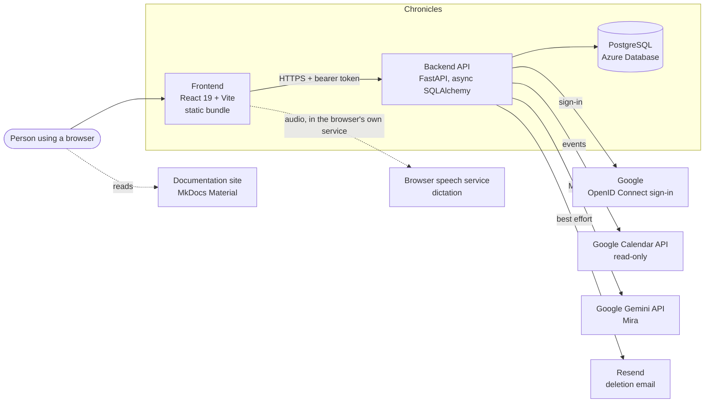
```mermaid
flowchart LR
    person([Person using a browser])
    subgraph chronicles["Chronicles"]
        fe["Frontend<br/>React 19 + Vite<br/>static bundle"]
        be["Backend API<br/>FastAPI, async SQLAlchemy"]
        db[("PostgreSQL<br/>Azure Database")]
    end
    google["Google<br/>OpenID Connect sign-in"]
    gcal["Google Calendar API<br/>read-only"]
    gemini["Google Gemini API<br/>Mira"]
    resend["Resend<br/>deletion email"]
    docs["Documentation site<br/>MkDocs Material"]
    speech["Browser speech service<br/>dictation"]

    person --> fe
    person -.->|reads| docs
    fe -->|HTTPS + bearer token| be
    be --> db
    be -->|sign-in| google
    be -->|events| gcal
    be -->|Mira| gemini
    be -->|best effort| resend
    fe -.->|audio, in the browser's own service| speech
```

*Source: `docs/api/external-services.md`, `app/config.py`, `speech.js`.*

## Deployment

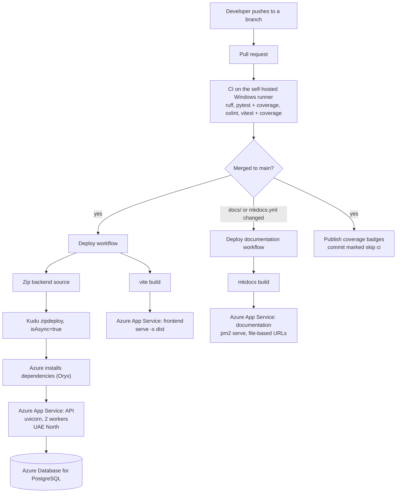
```mermaid
flowchart TB
    dev["Developer pushes to a branch"] --> pr["Pull request"]
    pr --> ci["CI on the self-hosted Windows runner<br/>ruff, pytest + coverage, oxlint, vitest + coverage"]
    ci --> merge{"Merged to main?"}
    merge -->|yes| deploy["Deploy workflow"]
    merge -->|docs/ or mkdocs.yml changed| dd["Deploy documentation workflow"]
    merge -->|yes| badges["Publish coverage badges<br/>commit marked skip ci"]

    deploy --> beZip["Zip backend source"]
    beZip --> kudu["Kudu zipdeploy, isAsync=true"]
    kudu --> oryx["Azure installs dependencies (Oryx)"]
    oryx --> api["Azure App Service: API<br/>uvicorn, 2 workers<br/>UAE North"]
    deploy --> feBuild["vite build"]
    feBuild --> app["Azure App Service: frontend<br/>serve -s dist"]
    dd --> mk["mkdocs build"]
    mk --> docsSite["Azure App Service: documentation<br/>pm2 serve, file-based URLs"]
    api --> pg[("Azure Database for PostgreSQL")]
```

*Source: `.gitea/workflows/*.yml`, `docs/development/deployment.md`; reasons in
[Decisions: platform](../decisions/platform-and-delivery.md).*

## Backend components

```mermaid
flowchart TB
    subgraph routers["Routers: HTTP, auth, status codes"]
        auth & projects & invitations & entries & tasks & saved_filters
        statistics & dashboard & streaks & achievements & transfer
        calendar & activities & ai & automation
    end
    subgraph logic["Domain logic: no HTTP"]
        schemas["schemas.py<br/>Pydantic models and validation"]
        computed["computed.py<br/>safe arithmetic"]
        custom_statistics["custom_statistics.py"]
        schema_migration["schema_migration.py"]
        automation_logic["automation.py<br/>rules, recurrence, reminders"]
        search["search.py"]
        statuses["statuses.py"]
        achievements_logic["achievements.py"]
        mira_tools["mira_tools.py<br/>closed list of functions"]
        mira_context["mira_context.py"]
    end
    subgraph infra["Infrastructure"]
        models["models.py<br/>SQLAlchemy ORM"]
        database["database.py<br/>engine, pool, JSONType"]
        security["security.py<br/>JWT"]
        config["config.py<br/>environment"]
        gemini["services/gemini_service.py"]
        email["email.py"]
    end

    routers --> logic
    routers --> models
    logic --> models
    models --> database
    projects --> schema_migration
    projects --> computed
    projects --> automation_logic
    projects --> statuses
    entries --> search
    automation_logic --> search
    statistics --> custom_statistics
    custom_statistics --> computed
    ai --> mira_tools
    ai --> mira_context
    ai --> gemini
    auth --> security
    auth --> email
    achievements --> achievements_logic
```

*Source: imports in `chronicles-logbook/backend/app`. Prefixes and responsibilities are in
[Backend](backend.md).*

## Frontend components

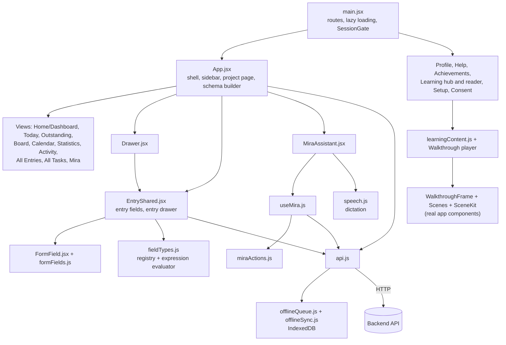
```mermaid
flowchart TB
    main["main.jsx<br/>routes, lazy loading, SessionGate"]
    main --> app["App.jsx<br/>shell, sidebar, project page, schema builder"]
    main --> pages["Profile, Help, Achievements,<br/>Learning hub and reader, Setup, Consent"]

    app --> views["Views: Home/Dashboard, Today, Outstanding,<br/>Board, Calendar, Statistics, Activity,<br/>All Entries, All Tasks, Mira"]
    app --> drawer["Drawer.jsx"]
    drawer --> shared["EntryShared.jsx<br/>entry fields, entry drawer"]
    app --> shared
    shared --> formfield["FormField.jsx + formFields.js"]
    shared --> fieldtypes["fieldTypes.js<br/>registry + expression evaluator"]

    app --> mira["MiraAssistant.jsx"]
    mira --> usemira["useMira.js"]
    usemira --> miraactions["miraActions.js"]
    mira --> speech["speech.js<br/>dictation"]

    pages --> learning["learningContent.js + Walkthrough player"]
    learning --> frame["WalkthroughFrame + Scenes + SceneKit<br/>(real app components)"]

    app --> api["api.js"]
    shared --> api
    usemira --> api
    api --> offline["offlineQueue.js + offlineSync.js<br/>IndexedDB"]
    api -->|HTTP| backend[(Backend API)]
```

*Source: imports in `chronicles-logbook/frontend/src`. File responsibilities are in [Frontend](frontend.md).*

## Full entity-relationship diagram

All 22 tables, generated from the SQLAlchemy models by script on 2026-10-09 so it cannot disagree with them.
Relationship labels are the foreign-key column and its delete rule. The older diagram on the
[Database](database.md) page is a hand-drawn summary and omits tables that came later.

```mermaid
erDiagram
    users ||--o{ calendar_activities : "user_id (cascade)"
    users ||--o{ dashboards : "user_id (cascade)"
    projects ||--o{ entries : "project_id (cascade)"
    users ||--o| entries : "created_by (set null)"
    entries ||--o{ entry_recurrences : "entry_id (cascade)"
    projects ||--o{ entry_recurrences : "project_id (cascade)"
    users ||--o| entry_recurrences : "created_by (set null)"
    entries ||--o{ entry_revisions : "entry_id (cascade)"
    users ||--o| entry_revisions : "changed_by (set null)"
    projects ||--o{ entry_rules : "project_id (cascade)"
    users ||--o| entry_rules : "created_by (set null)"
    users ||--o{ google_calendar_accounts : "user_id (cascade)"
    users ||--o{ google_calendar_tokens : "user_id (cascade)"
    users ||--o{ login_sessions : "user_id (cascade)"
    users ||--o{ mira_consents : "user_id (cascade)"
    users ||--o{ mira_conversations : "user_id (cascade)"
    mira_conversations ||--o{ mira_messages : "conversation_id (cascade)"
    projects ||--o{ project_members : "project_id (cascade)"
    users ||--o{ project_members : "user_id (cascade)"
    users ||--o| project_members : "invited_by (set null)"
    users ||--o{ projects : "user_id (cascade)"
    entry_recurrences ||--o{ recurrence_occurrences : "recurrence_id (cascade)"
    entries ||--o| recurrence_occurrences : "entry_id (set null)"
    users ||--o{ saved_filters : "user_id (cascade)"
    users ||--o{ saved_statistics : "user_id (cascade)"
    projects ||--o{ saved_statistics : "project_id (cascade)"
    users ||--o{ statistics_layouts : "user_id (cascade)"
    projects ||--o{ tasks : "project_id"
    users ||--o| tasks : "created_by (set null)"
    users ||--o| tasks : "completed_by (set null)"
    users ||--o{ user_achievements : "user_id (cascade)"
    users ||--o{ user_activity_days : "user_id (cascade)"
    calendar_activities {
        char id PK
        char user_id FK
        varchar title
        varchar description
        date day
        boolean all_day
        varchar start_time
        varchar end_time
        datetime created_at
    }
    dashboards {
        char id PK
        char user_id FK,UK
        jsonb panels
        integer columns
        datetime created_at
        datetime updated_at
    }
    entries {
        char id PK
        char project_id FK
        varchar title
        jsonb data
        integer schema_version
        jsonb schema_snapshot
        jsonb retired_data
        char created_by FK
        integer time_spent
        boolean todo
        varchar status
        date due_date
        time due_time
        datetime created_at
        datetime updated_at
        datetime deleted_at
    }
    entry_recurrences {
        char id PK
        char entry_id FK
        char project_id FK
        varchar frequency
        integer interval
        date starts_on
        date ends_on
        integer next_index
        date next_on
        boolean active
        char created_by FK
        datetime created_at
    }
    entry_revisions {
        char id PK
        char entry_id FK
        integer revision
        varchar title
        jsonb data
        jsonb retired_data
        integer schema_version
        jsonb schema_snapshot
        integer time_spent
        boolean todo
        varchar status
        date due_date
        time due_time
        char changed_by FK
        datetime changed_at
        varchar action
        text note
        jsonb changed_fields
        jsonb previous_values
        integer reverted_to
    }
    entry_rules {
        char id PK
        char project_id FK
        varchar name
        boolean enabled
        varchar match
        jsonb conditions
        jsonb actions
        varchar trigger
        varchar trigger_status
        char created_by FK
        datetime created_at
        datetime updated_at
    }
    google_calendar_accounts {
        char id PK
        char user_id FK
        varchar calendar_id
        varchar label
        varchar refresh_token
        datetime created_at
    }
    google_calendar_tokens {
        char user_id PK,FK
        varchar refresh_token
        datetime created_at
        datetime updated_at
    }
    login_sessions {
        varchar token_hash PK
        char user_id FK
        datetime expires_at
    }
    mira_consents {
        char user_id PK,FK
        boolean accepted
        varchar version
        datetime updated_at
    }
    mira_conversations {
        char id PK
        char user_id FK
        varchar title
        datetime created_at
        datetime updated_at
    }
    mira_messages {
        char id PK
        char conversation_id FK
        varchar role
        varchar content
        varchar thinking
        datetime created_at
    }
    project_members {
        char id PK
        char project_id FK
        char user_id FK
        varchar status
        char invited_by FK
        datetime responded_at
        datetime created_at
    }
    projects {
        char id PK
        char user_id FK
        varchar name
        varchar description
        boolean archived
        jsonb statuses
        jsonb entry_schema
        integer schema_version
        jsonb retired_schema
        datetime created_at
        datetime updated_at
    }
    recurrence_occurrences {
        char id PK
        char recurrence_id FK
        date occurrence_on
        char entry_id FK
        datetime created_at
    }
    saved_filters {
        char id PK
        char user_id FK
        varchar name
        jsonb criteria
        datetime created_at
        datetime updated_at
    }
    saved_statistics {
        char id PK
        char user_id FK
        char project_id FK
        varchar name
        varchar expression
        datetime created_at
        datetime updated_at
    }
    statistics_layouts {
        char user_id PK,FK
        jsonb panels
        datetime updated_at
    }
    tasks {
        char id PK
        char project_id FK
        varchar title
        varchar description
        date due_date
        time due_time
        boolean completed
        char created_by FK
        char completed_by FK
        jsonb checklist
        datetime created_at
        datetime updated_at
    }
    user_achievements {
        char user_id PK,FK
        varchar key PK
        datetime earned_at
        boolean seen
    }
    user_activity_days {
        char user_id PK,FK
        date day PK
        varchar kind PK
    }
    users {
        char id PK
        varchar google_sub UK
        varchar full_name
        varchar email UK
        varchar avatar_url
        datetime created_at
        datetime updated_at
    }
```

### What deletes what

The delete rules matter more than the lines. They follow DB-44 and DB-45 in
[Decisions](../decisions/data-and-backend.md).

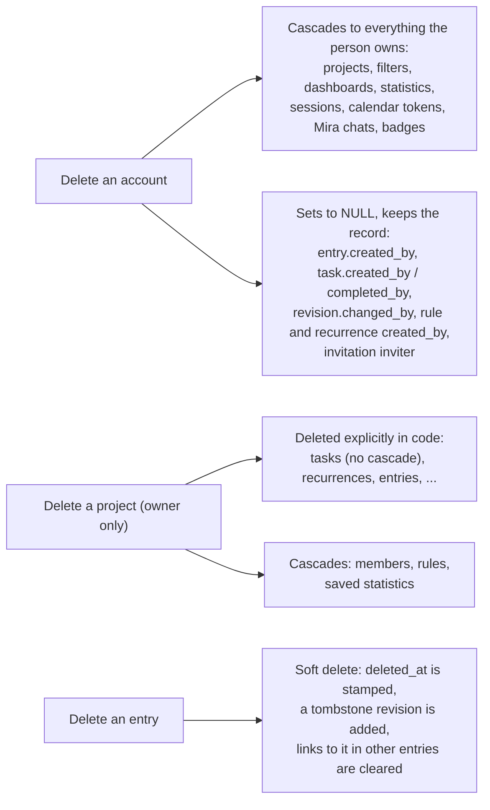
```mermaid
flowchart LR
    user["Delete an account"] --> cascadeUser["Cascades to everything the person owns:<br/>projects, filters, dashboards, statistics,<br/>sessions, calendar tokens, Mira chats, badges"]
    user --> setNull["Sets to NULL, keeps the record:<br/>entry.created_by, task.created_by / completed_by,<br/>revision.changed_by, rule and recurrence created_by,<br/>invitation inviter"]
    project["Delete a project (owner only)"] --> explicit["Deleted explicitly in code:<br/>tasks (no cascade), recurrences, entries, ..."]
    project --> cascadeProject["Cascades: members, rules,<br/>saved statistics"]
    entry["Delete an entry"] --> tomb["Soft delete: deleted_at is stamped,<br/>a tombstone revision is added,<br/>links to it in other entries are cleared"]
```

## Field definitions (class diagram)

A schema is a list of these. `FieldDefinition` is a discriminated union on `type`, so an unknown type is rejected
when the request is parsed. *Source: `app/schemas.py`.*

```mermaid
classDiagram
    class BaseFieldDefinition {
        +str id
        +str name
        +FieldType type
        +bool required = true
    }
    class TextFieldDefinition { type = text  max 255 }
    class LongTextFieldDefinition { type = long_text  max 5000 }
    class NumberFieldDefinition { type = number }
    class DateFieldDefinition { type = date  YYYY-MM-DD }
    class DropdownFieldDefinition { type = dropdown  +list~str~ options }
    class TagsFieldDefinition { type = tags  1-10 tags, 30 chars }
    class ChecklistFieldDefinition { type = checklist  up to 20 items }
    class LinkFieldDefinition { type = link  same project only }
    class ProjectReferenceFieldDefinition { type = project_reference  +UUID linked_project_id }
    class ComputedFieldDefinition { type = computed  +str expression  max 500 }

    BaseFieldDefinition <|-- TextFieldDefinition
    BaseFieldDefinition <|-- LongTextFieldDefinition
    BaseFieldDefinition <|-- NumberFieldDefinition
    BaseFieldDefinition <|-- DateFieldDefinition
    BaseFieldDefinition <|-- DropdownFieldDefinition
    BaseFieldDefinition <|-- TagsFieldDefinition
    BaseFieldDefinition <|-- ChecklistFieldDefinition
    BaseFieldDefinition <|-- LinkFieldDefinition
    BaseFieldDefinition <|-- ProjectReferenceFieldDefinition
    BaseFieldDefinition <|-- ComputedFieldDefinition
```

## Rule actions (class diagram)

*Source: `app/schemas.py`, `app/automation.py`.*

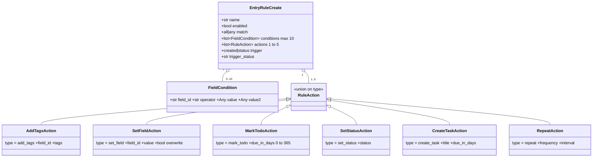
```mermaid
classDiagram
    class EntryRuleCreate {
        +str name
        +bool enabled
        +all|any match
        +list~FieldCondition~ conditions  max 10
        +list~RuleAction~ actions  1 to 5
        +created|status trigger
        +str trigger_status
    }
    class FieldCondition { +str field_id  +str operator  +Any value  +Any value2 }
    class RuleAction { <<union on type>> }
    class AddTagsAction { type = add_tags  +field_id  +tags }
    class SetFieldAction { type = set_field  +field_id  +value  +bool overwrite }
    class MarkTodoAction { type = mark_todo  +due_in_days  0 to 365 }
    class SetStatusAction { type = set_status  +status }
    class CreateTaskAction { type = create_task  +title  +due_in_days }
    class RepeatAction { type = repeat  +frequency  +interval }

    EntryRuleCreate "1" o-- "0..10" FieldCondition
    EntryRuleCreate "1" o-- "1..5" RuleAction
    RuleAction <|-- AddTagsAction
    RuleAction <|-- SetFieldAction
    RuleAction <|-- MarkTodoAction
    RuleAction <|-- SetStatusAction
    RuleAction <|-- CreateTaskAction
    RuleAction <|-- RepeatAction
```

A rule whose trigger is `status` may only use `create_task` and `repeat` (follow-ups); the entry's own values are
left exactly as the person saved them.

## Core models (class diagram)

The central objects, with the columns that carry the design. *Source: `app/models.py`.*

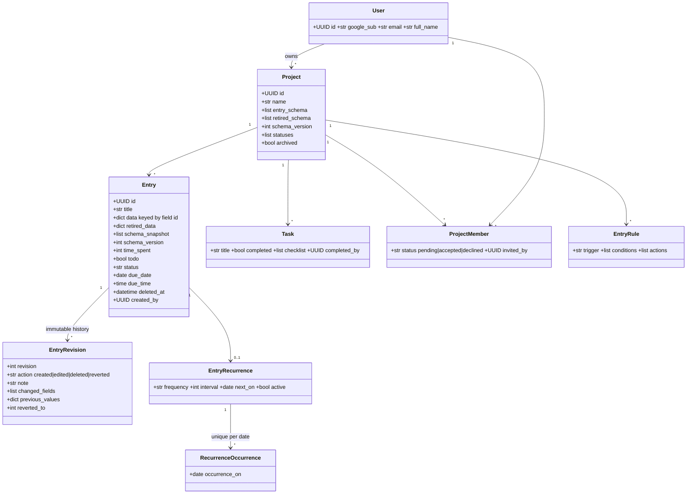
```mermaid
classDiagram
    class User { +UUID id  +str google_sub  +str email  +str full_name }
    class Project {
        +UUID id
        +str name
        +list entry_schema
        +list retired_schema
        +int schema_version
        +list statuses
        +bool archived
    }
    class Entry {
        +UUID id
        +str title
        +dict data  keyed by field id
        +dict retired_data
        +list schema_snapshot
        +int schema_version
        +int time_spent
        +bool todo
        +str status
        +date due_date
        +time due_time
        +datetime deleted_at
        +UUID created_by
    }
    class EntryRevision {
        +int revision
        +str action  created|edited|deleted|reverted
        +str note
        +list changed_fields
        +dict previous_values
        +int reverted_to
    }
    class Task { +str title  +bool completed  +list checklist  +UUID completed_by }
    class ProjectMember { +str status  pending|accepted|declined  +UUID invited_by }
    class EntryRule { +str trigger  +list conditions  +list actions }
    class EntryRecurrence { +str frequency  +int interval  +date next_on  +bool active }
    class RecurrenceOccurrence { +date occurrence_on }

    User "1" --> "*" Project : owns
    Project "1" --> "*" Entry
    Project "1" --> "*" Task
    Project "1" --> "*" ProjectMember
    User "1" --> "*" ProjectMember
    Project "1" --> "*" EntryRule
    Entry "1" --> "*" EntryRevision : immutable history
    Entry "1" --> "0..1" EntryRecurrence
    EntryRecurrence "1" --> "*" RecurrenceOccurrence : unique per date
```

## Sequence diagrams

### Signing in and staying signed in

*Source: `app/routers/auth.py`, `api.js`. Decisions DB-54 to DB-57, DB-64.*

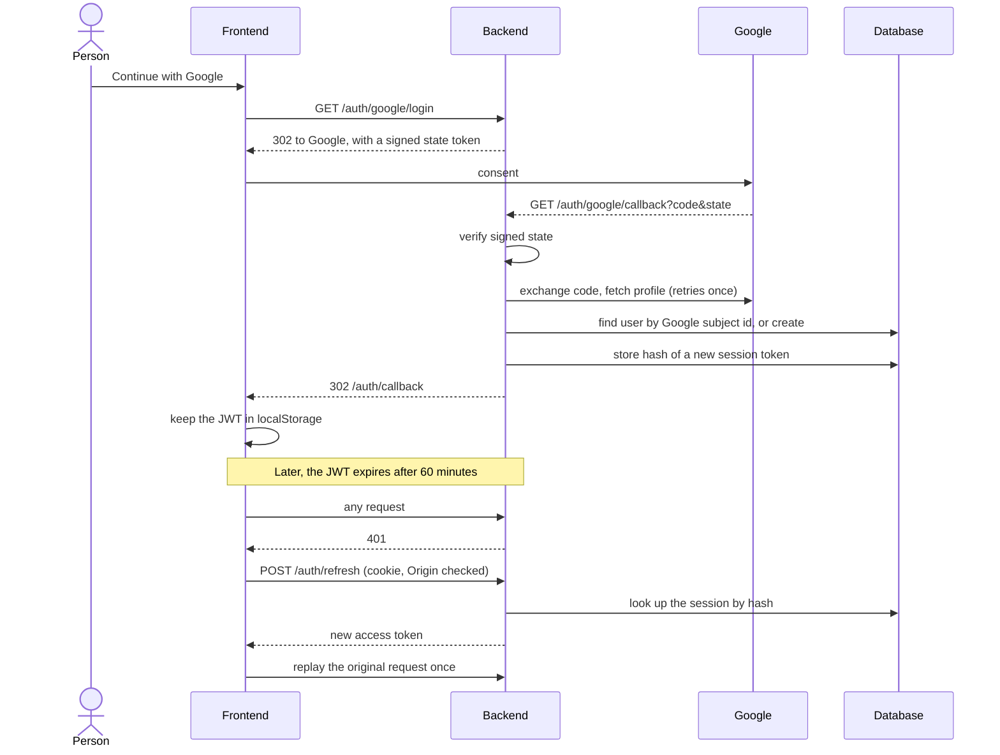
```mermaid
sequenceDiagram
    actor U as Person
    participant FE as Frontend
    participant BE as Backend
    participant G as Google
    participant DB as Database

    U->>FE: Continue with Google
    FE->>BE: GET /auth/google/login
    BE-->>FE: 302 to Google, with a signed state token
    FE->>G: consent
    G-->>BE: GET /auth/google/callback?code&state
    BE->>BE: verify signed state
    BE->>G: exchange code, fetch profile (retries once)
    BE->>DB: find user by Google subject id, or create
    BE->>DB: store hash of a new session token
    BE-->>FE: 302 /auth/callback#token=JWT, Set-Cookie chronicles_refresh
    FE->>FE: keep the JWT in localStorage

    Note over FE,BE: Later, the JWT expires after 60 minutes
    FE->>BE: any request
    BE-->>FE: 401
    FE->>BE: POST /auth/refresh (cookie, Origin checked)
    BE->>DB: look up the session by hash
    BE-->>FE: new access token
    FE->>BE: replay the original request once
```

### Creating an entry

*Source: `app/routers/projects.py`, `app/automation.py`, `app/computed.py`. Decisions DB-20, DB-23, DB-27 to DB-29.*

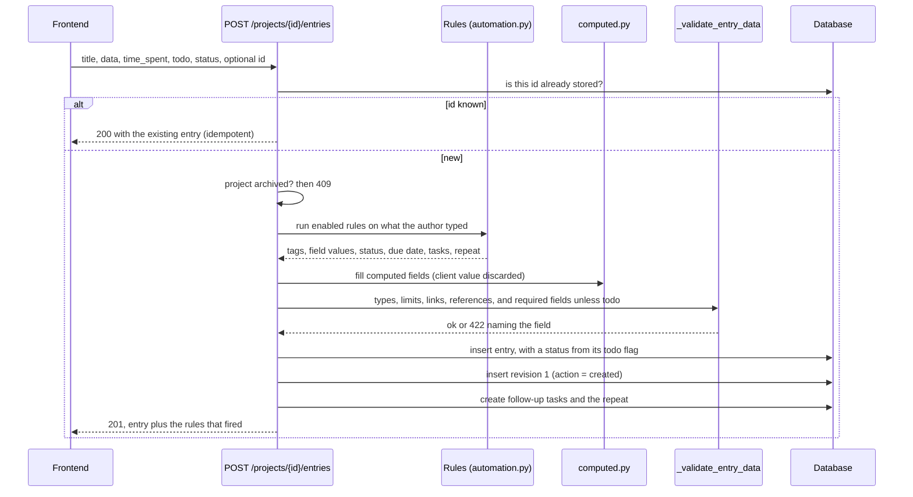
```mermaid
sequenceDiagram
    participant FE as Frontend
    participant API as POST /projects/{id}/entries
    participant R as Rules (automation.py)
    participant C as computed.py
    participant V as _validate_entry_data
    participant DB as Database

    FE->>API: title, data, time_spent, todo, status, optional id
    API->>DB: is this id already stored?
    alt id known
        API-->>FE: 200 with the existing entry (idempotent)
    else new
        API->>API: project archived? then 409
        API->>R: run enabled rules on what the author typed
        R-->>API: tags, field values, status, due date, tasks, repeat
        API->>C: fill computed fields (client value discarded)
        API->>V: types, limits, links, references, and required fields unless todo
        V-->>API: ok or 422 naming the field
        API->>DB: insert entry, with a status from its todo flag
        API->>DB: insert revision 1 (action = created)
        API->>DB: create follow-up tasks and the repeat
        API-->>FE: 201, entry plus the rules that fired
    end
```

### Editing a schema, then one entry

*Source: `app/schema_migration.py`, `app/routers/projects.py`. Decisions DB-10 to DB-13.*

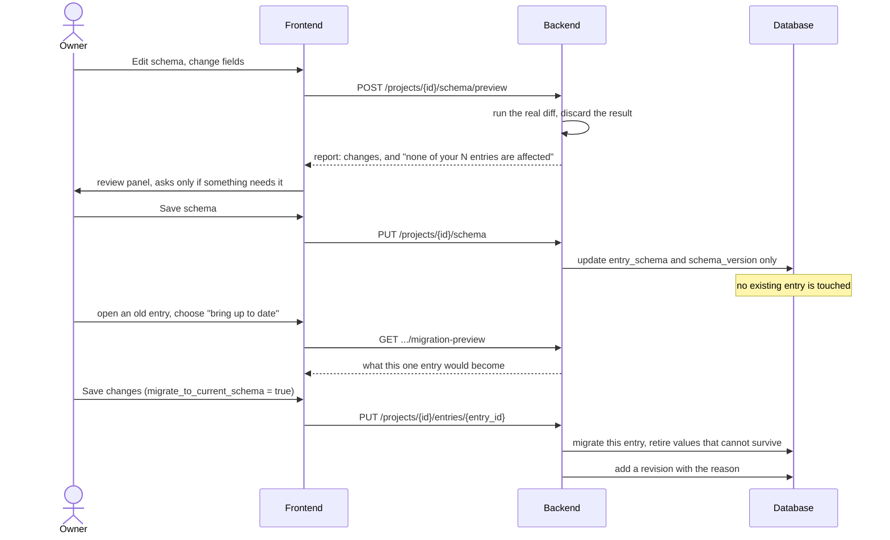
```mermaid
sequenceDiagram
    actor O as Owner
    participant FE as Frontend
    participant API as Backend
    participant DB as Database

    O->>FE: Edit schema, change fields
    FE->>API: POST /projects/{id}/schema/preview
    API->>API: run the real diff, discard the result
    API-->>FE: report: changes, and "none of your N entries are affected"
    FE->>O: review panel, asks only if something needs it
    O->>FE: Save schema
    FE->>API: PUT /projects/{id}/schema
    API->>DB: update entry_schema and schema_version only
    Note over DB: no existing entry is touched

    O->>FE: open an old entry, choose "bring up to date"
    FE->>API: GET .../migration-preview
    API-->>FE: what this one entry would become
    O->>FE: Save changes (migrate_to_current_schema = true)
    FE->>API: PUT /projects/{id}/entries/{entry_id}
    API->>DB: migrate this entry, retire values that cannot survive
    API->>DB: add a revision with the reason
```

### Capturing offline, then syncing

*Source: `offlineQueue.js`, `offlineSync.js`. Decisions UI-54 to UI-56.*

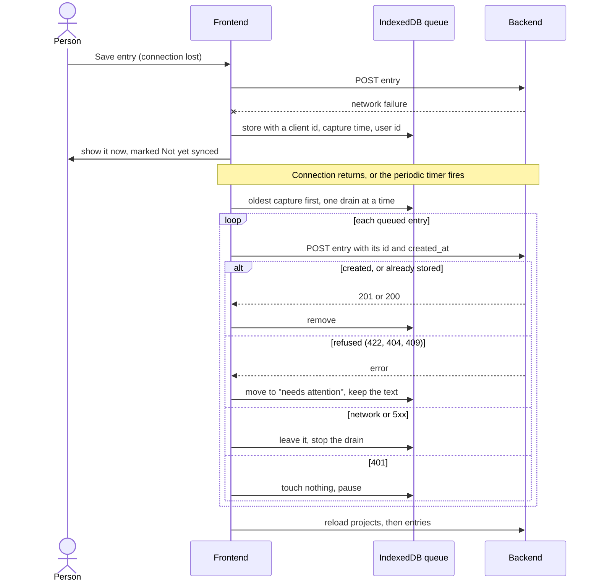
```mermaid
sequenceDiagram
    actor U as Person
    participant FE as Frontend
    participant Q as IndexedDB queue
    participant API as Backend

    U->>FE: Save entry (connection lost)
    FE->>API: POST entry
    API--xFE: network failure
    FE->>Q: store with a client id, capture time, user id
    FE->>U: show it now, marked Not yet synced

    Note over FE,API: Connection returns, or the periodic timer fires
    FE->>Q: oldest capture first, one drain at a time
    loop each queued entry
        FE->>API: POST entry with its id and created_at
        alt created, or already stored
            API-->>FE: 201 or 200
            FE->>Q: remove
        else refused (422, 404, 409)
            API-->>FE: error
            FE->>Q: move to "needs attention", keep the text
        else network or 5xx
            FE->>Q: leave it, stop the drain
        else 401
            FE->>Q: touch nothing, pause
        end
    end
    FE->>API: reload projects, then entries
```

### Mira: act, show, check

*Source: `useMira.js`, `miraActions.js`, `app/routers/ai.py`, `app/mira_tools.py`. Decisions UI-25 to UI-28.*

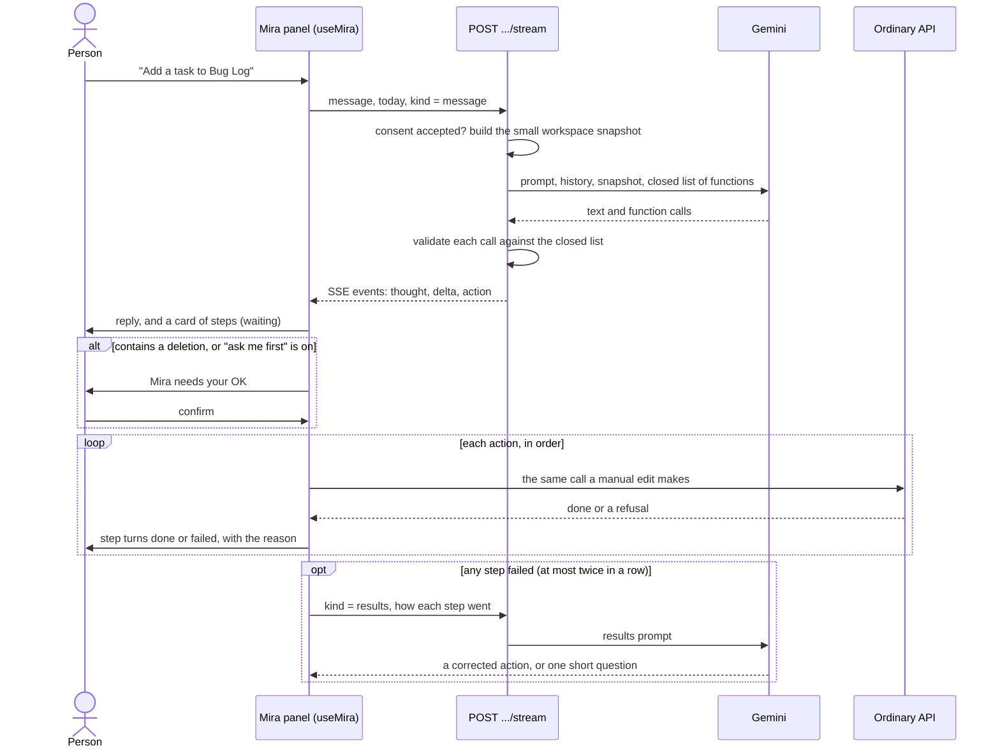
```mermaid
sequenceDiagram
    actor U as Person
    participant FE as Mira panel (useMira)
    participant API as POST .../stream
    participant M as Gemini
    participant App as Ordinary API

    U->>FE: "Add a task to Bug Log"
    FE->>API: message, today, kind = message
    API->>API: consent accepted? build the small workspace snapshot
    API->>M: prompt, history, snapshot, closed list of functions
    M-->>API: text and function calls
    API->>API: validate each call against the closed list
    API-->>FE: SSE events: thought, delta, action
    FE->>U: reply, and a card of steps (waiting)
    alt contains a deletion, or "ask me first" is on
        FE->>U: Mira needs your OK
        U->>FE: confirm
    end
    loop each action, in order
        FE->>App: the same call a manual edit makes
        App-->>FE: done or a refusal
        FE->>U: step turns done or failed, with the reason
    end
    opt any step failed (at most twice in a row)
        FE->>API: kind = results, how each step went
        API->>M: results prompt
        M-->>FE: a corrected action, or one short question
    end
```

### Recurring entries without a scheduler

*Source: `app/automation.py`, `app/routers/automation.py`. Decision DB-30.*

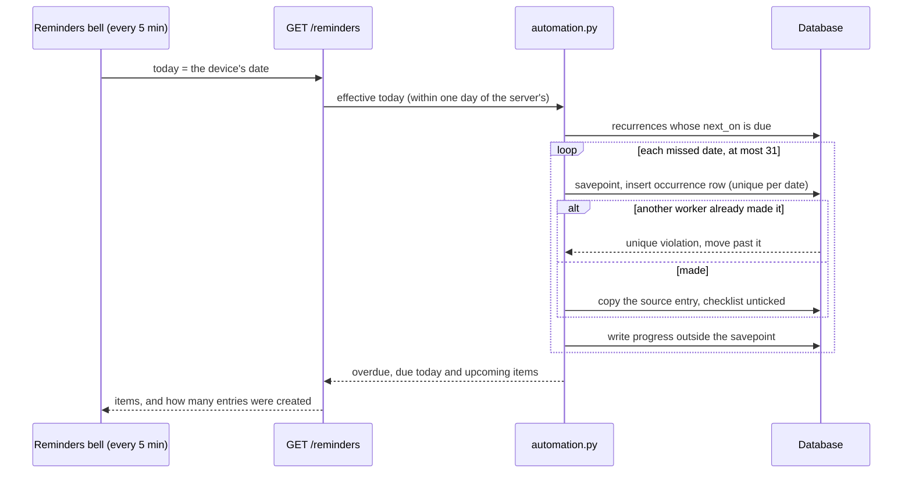
```mermaid
sequenceDiagram
    participant FE as Reminders bell (every 5 min)
    participant API as GET /reminders
    participant A as automation.py
    participant DB as Database

    FE->>API: today = the device's date
    API->>A: effective today (within one day of the server's)
    A->>DB: recurrences whose next_on is due
    loop each missed date, at most 31
        A->>DB: savepoint, insert occurrence row (unique per date)
        alt another worker already made it
            DB-->>A: unique violation, move past it
        else made
            A->>DB: copy the source entry, checklist unticked
        end
        A->>DB: write progress outside the savepoint
    end
    A-->>API: overdue, due today and upcoming items
    API-->>FE: items, and how many entries were created
```

### Sharing a project

*Source: `app/routers/projects.py`, `app/routers/invitations.py`. Decisions DB-41, DB-42.*

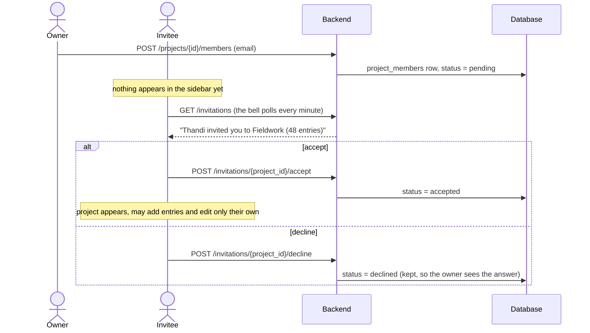
```mermaid
sequenceDiagram
    actor O as Owner
    actor I as Invitee
    participant API as Backend
    participant DB as Database

    O->>API: POST /projects/{id}/members (email)
    API->>DB: project_members row, status = pending
    Note over I: nothing appears in the sidebar yet
    I->>API: GET /invitations (the bell polls every minute)
    API-->>I: "Thandi invited you to Fieldwork (48 entries)"
    alt accept
        I->>API: POST /invitations/{project_id}/accept
        API->>DB: status = accepted
        Note over I: project appears, may add entries and edit only their own
    else decline
        I->>API: POST /invitations/{project_id}/decline
        API->>DB: status = declined (kept, so the owner sees the answer)
    end
```

### Importing a backup

*Source: `app/routers/transfer.py`. Decision DB-48.*

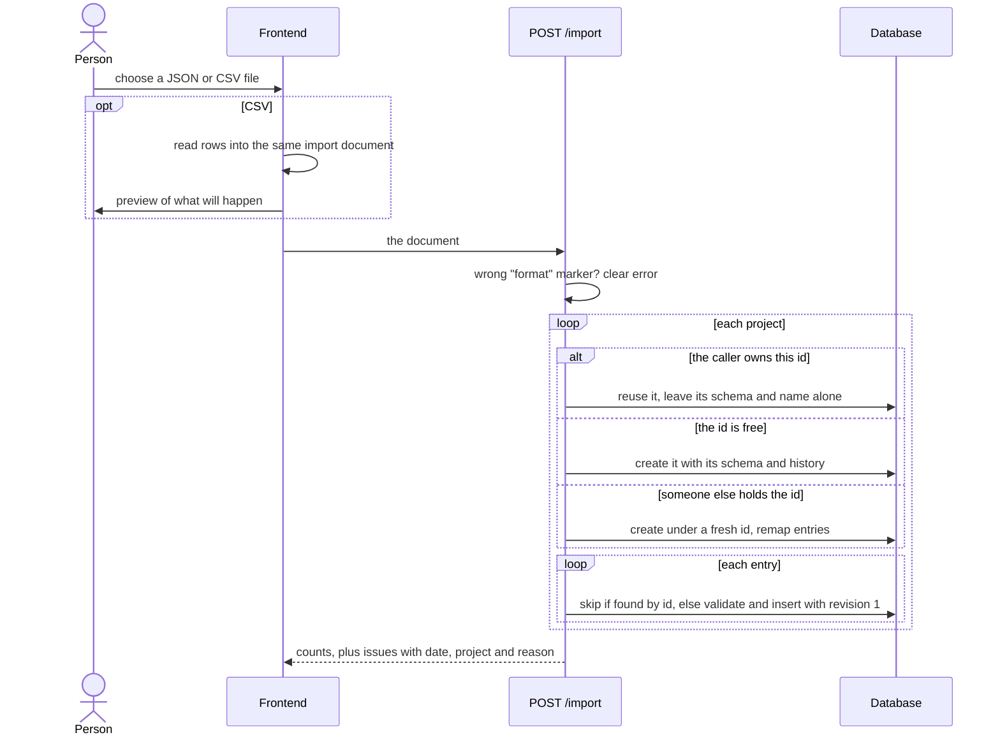
```mermaid
sequenceDiagram
    actor U as Person
    participant FE as Frontend
    participant API as POST /import
    participant DB as Database

    U->>FE: choose a JSON or CSV file
    opt CSV
        FE->>FE: read rows into the same import document
        FE->>U: preview of what will happen
    end
    FE->>API: the document
    API->>API: wrong "format" marker? clear error
    loop each project
        alt the caller owns this id
            API->>DB: reuse it, leave its schema and name alone
        else the id is free
            API->>DB: create it with its schema and history
        else someone else holds the id
            API->>DB: create under a fresh id, remap entries
        end
        loop each entry
            API->>DB: skip if found by id, else validate and insert with revision 1
        end
    end
    API-->>FE: counts, plus issues with date, project and reason
```

## Activity diagrams

### Validating an entry

*Source: `_validate_entry_data` and the update route in `app/routers/projects.py`.*

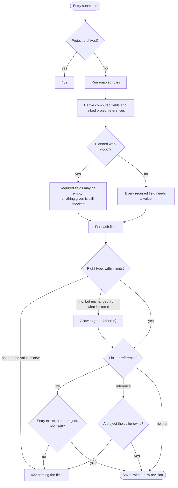
```mermaid
flowchart TD
    start([Entry submitted]) --> arch{"Project archived?"}
    arch -->|yes| e409["409"]
    arch -->|no| rules["Run enabled rules"]
    rules --> computed["Derive computed fields and linked project references"]
    computed --> todo{"Planned work<br/>(todo)?"}
    todo -->|yes| loose["Required fields may be empty;<br/>anything given is still checked"]
    todo -->|no| strict["Every required field needs a value"]
    loose --> each
    strict --> each
    each["For each field"] --> typecheck{"Right type, within limits?"}
    typecheck -->|no, and the value is new| e422["422 naming the field"]
    typecheck -->|"no, but unchanged from what is stored"| keep["Allow it (grandfathered)"]
    typecheck -->|yes| special{"Link or reference?"}
    keep --> special
    special -->|link| linkcheck{"Entry exists, same project,<br/>not itself?"}
    special -->|reference| refcheck{"A project the caller owns?"}
    special -->|neither| ok
    linkcheck -->|no| e422
    linkcheck -->|yes| ok
    refcheck -->|no| e422
    refcheck -->|yes| ok
    ok(["Saved with a new revision"])
```

### Deciding how the drawer shares the screen

*Source: `Drawer.jsx`, `Drawer.css`. Decision UI-13.*

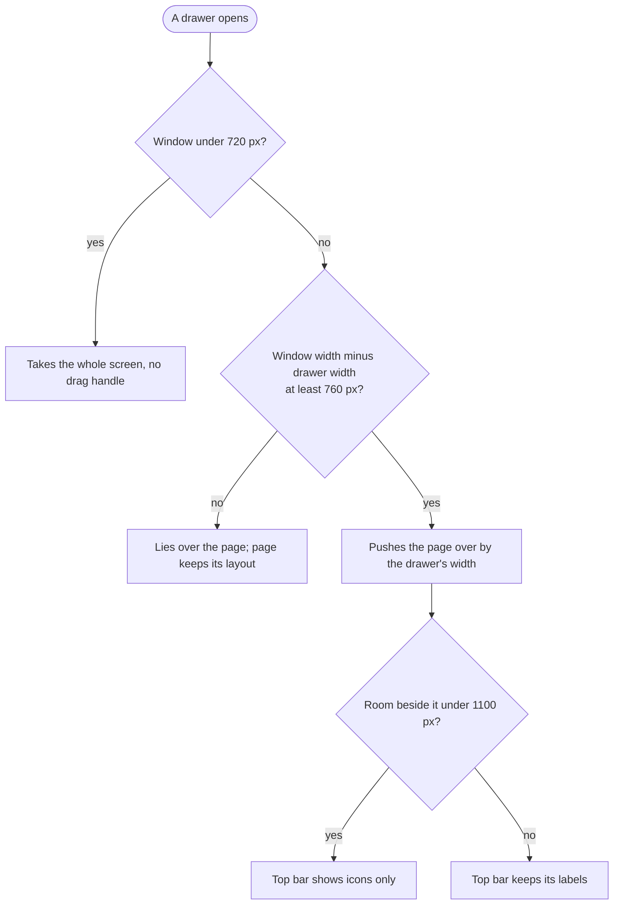
```mermaid
flowchart TD
    open([A drawer opens]) --> phone{"Window under 720 px?"}
    phone -->|yes| full["Takes the whole screen, no drag handle"]
    phone -->|no| room{"Window width minus drawer width<br/>at least 760 px?"}
    room -->|no| overlay["Lies over the page; page keeps its layout"]
    room -->|yes| push["Pushes the page over by the drawer's width"]
    push --> compact{"Room beside it under 1100 px?"}
    compact -->|yes| icons["Top bar shows icons only"]
    compact -->|no| labels["Top bar keeps its labels"]
```

### A Mira batch

*Source: `miraActions.js` (`runActions`).*

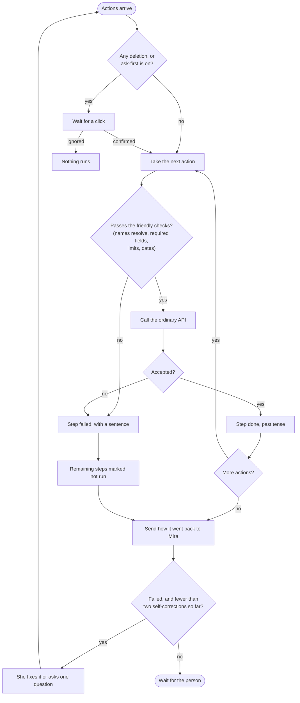
```mermaid
flowchart TD
    batch([Actions arrive]) --> del{"Any deletion, or<br/>ask-first is on?"}
    del -->|yes| wait["Wait for a click"]
    del -->|no| run
    wait -->|confirmed| run
    wait -->|ignored| skip["Nothing runs"]
    run["Take the next action"] --> pre{"Passes the friendly checks?<br/>(names resolve, required fields,<br/>limits, dates)"}
    pre -->|no| fail["Step failed, with a sentence"]
    pre -->|yes| callApi["Call the ordinary API"]
    callApi --> accepted{"Accepted?"}
    accepted -->|yes| done["Step done, past tense"]
    accepted -->|no| fail
    done --> more{"More actions?"}
    more -->|yes| run
    more -->|no| report
    fail --> rest["Remaining steps marked not run"]
    rest --> report["Send how it went back to Mira"]
    report --> again{"Failed, and fewer than<br/>two self-corrections so far?"}
    again -->|yes| fix["She fixes it or asks one question"]
    again -->|no| end1([Wait for the person])
    fix --> batch
```

### Saving a project's schema

*Source: `SchemaBuilder` in `App.jsx`.*

```mermaid
flowchart TD
    view["Reading the schema"] --> edit["Press Edit schema"]
    edit --> changes{"Anything changed?"}
    changes -->|no| nosave["Save is disabled"]
    changes -->|yes| check{"Passes the same rules<br/>the server enforces?"}
    check -->|no| inline["Problem shown beside the field"]
    check -->|yes| preview["Ask the server what it would do"]
    preview --> affected{"Does it involve entries<br/>already recorded?"}
    affected -->|no| apply["Save at once"]
    affected -->|yes| review["Show the review panel"]
    review -->|keep editing| edit
    review -->|apply| apply
    apply --> refetch["Refetch the entries"]
    refetch --> view
```

## State diagrams

### An entry's life

*Source: `app/statuses.py`, `app/routers/projects.py`, `EntryHistory.jsx`. Decisions DB-22, DB-27.*

```mermaid
stateDiagram-v2
    [*] --> StillToDo: logged as planned work
    [*] --> Done: logged as finished
    StillToDo --> InProgress: custom status
    InProgress --> Done
    StillToDo --> Done: finish (needs required fields)
    Done --> StillToDo: reopen
    StillToDo --> Deleted: delete
    InProgress --> Deleted
    Done --> Deleted
    Deleted --> StillToDo: restore (revert to the version before)
    Deleted --> Done: restore
    note right of Deleted
        a tombstone version; the row stays,
        and its history is never removed
    end note
```

Statuses shown are the defaults plus one example of a custom one; each project defines 2 to 8, each marked done or
not done, and `todo` is derived from that.

### A project invitation

```mermaid
stateDiagram-v2
    [*] --> pending: owner shares
    pending --> accepted: invitee accepts
    pending --> declined: invitee declines
    declined --> pending: owner invites again
    accepted --> [*]: member leaves, or owner withdraws
    pending --> [*]: owner cancels
    declined --> [*]: owner withdraws
```

Rows that existed before invitations were introduced start as `accepted`, so nobody lost access.

### A recurrence

```mermaid
stateDiagram-v2
    [*] --> Active: Repeat set on an entry
    Active --> Active: a request finds an occurrence due, creates it
    Active --> Active: replaced (schedule restarts, old occurrences stay)
    Active --> Finished: past its end date (next_on becomes null)
    Active --> Stopped: Stop repeating
    Stopped --> Active: set again
    Finished --> [*]
```

### A queued offline entry

```mermaid
stateDiagram-v2
    [*] --> Queued: captured offline
    Queued --> Sending: connection back, drain starts
    Sending --> Synced: created or already stored
    Sending --> Queued: network or server failure
    Sending --> NeedsAttention: refused (archived, schema changed)
    Sending --> Queued: session expired (paused)
    NeedsAttention --> Queued: person edits it
    NeedsAttention --> [*]: person discards it
    Synced --> [*]
```

### Mira's consent

```mermaid
stateDiagram-v2
    [*] --> Undecided
    Undecided --> Accepted: accepts the current notice
    Undecided --> Declined: declines
    Accepted --> Declined: changes mind
    Declined --> Accepted: changes mind
    Accepted --> Undecided: notice version is bumped
    Declined --> Undecided: notice version is bumped
```

Declined keeps the whole app usable; Mira then answers in limited mode and nothing is sent to Gemini.

## API map

Every router, with what it owns. Detailed pages are in the API reference; each path is checked against the code by
`scripts/docs_audit.py`.

```mermaid
mindmap
  root((Chronicles API))
    Identity
      /auth
        google login and callback
        dev-login, local only
        refresh and logout
        me
        delete account
      /invitations
        list
        accept
        decline
    Records
      /projects
        CRUD, archive
        schema and preview
        entries
        history, revert, restore
        members for sharing, leave
        export.csv
      per-project tasks
      /entries
        search, filters, relevance
      /saved-filters
    Automation
      per-project rules
      recurrence
      /reminders
    Insight
      /statistics
        totals, activity, layout
        field statistics, timelines
        custom
      /dashboard
      /streaks
      /achievements
    Planning
      /calendar
        google status, auth, events
      /calendar/activities
    Assistant
      /ai
        consent
        conversations
        stream
    Data
      /export
      /import
    Health
      /health
```

### Who may do what

```mermaid
flowchart LR
    subgraph roles["Roles on a project"]
        owner["Owner"]
        member["Accepted member"]
        pending["Pending or declined invitee"]
        other["Anyone else"]
    end
    owner -->|"schema, archive, delete, export, share, rules"| structure["Reshape the project"]
    owner -->|"any entry, any task"| edit_all["Edit everything"]
    member -->|"read, add entries and tasks, tick tasks"| contribute["Contribute"]
    member -->|"only entries they wrote"| edit_own["Edit or delete their own"]
    pending -->|"nothing"| none["No access"]
    other -->|"404, as if it did not exist"| none
```

*Source: `_get_user_project`, `_get_writable_entry`, `app/routers/tasks.py`. Decisions DB-42, DB-43.*

AI Declaration: Diagrams drafted with Claude Code (Sonnet 5.5) from the source code on 2026-10-09; the
entity-relationship diagram is generated by script from `app/models.py`.
